# My Clinic (عيادتي)

A clinic assistant for doctors of any specialty. It runs fully offline on the
doctor's phone, in English or Arabic (right-to-left), in light or dark mode.

<p align="center">
  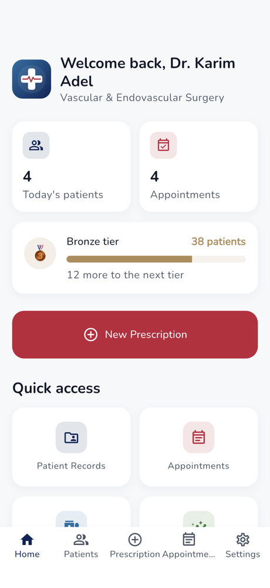
  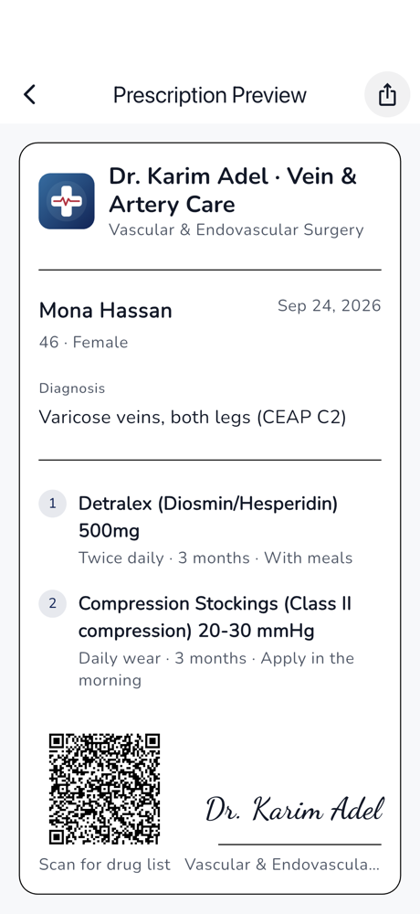
  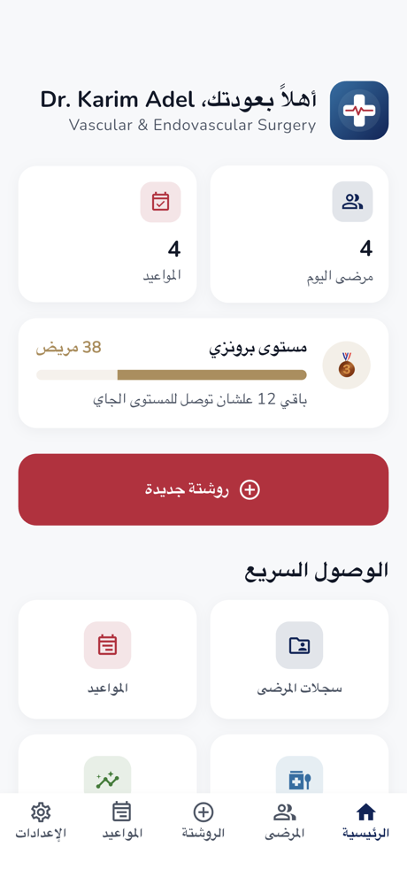
</p>

## Demo video

A three-minute walk-through of every main feature, recorded on an iPhone 17
Pro simulator with the built-in demo clinic:

**[▶ Watch the demo (MP4)](docs/demo/my_clinic_demo.mp4)**

## Features

- **Home.** Today's patients and appointments, recent patients, milestone
  tiers, and a daily reminder notification to log the day's patients.
- **Patients.** Add, edit, search by name or phone, and delete patient files.
  Each file has medical history, current treatment, visits and prescriptions.
- **Prescriptions.** Pick a patient and drugs, set dose, frequency, duration
  and timing, and dictate the diagnosis by voice. Save a draft and finish it
  later, or issue it. An issued prescription becomes the patient's current
  treatment.
- **Share.** The preview renders the prescription on your letterhead with a
  QR code that holds the drug list. Share it as an image to WhatsApp, print,
  or files.
- **Appointments.** Week view with busy-day markers. Book, edit, mark done,
  cancel or delete visits. Marking a visit done updates the patient's last
  visit.
- **Drug database.** A built-in starter list plus your own drugs. Add drugs
  from this screen or straight from the prescription search.
- **Clinic stats.** Patient totals, monthly prescriptions and visits, gender
  split, and your most prescribed drugs.
- **Arabic and dark mode.** Every screen works right-to-left, in light or
  dark theme.

## Screenshots

| Home | Patients | Patient file |
| :---: | :---: | :---: |
|  | 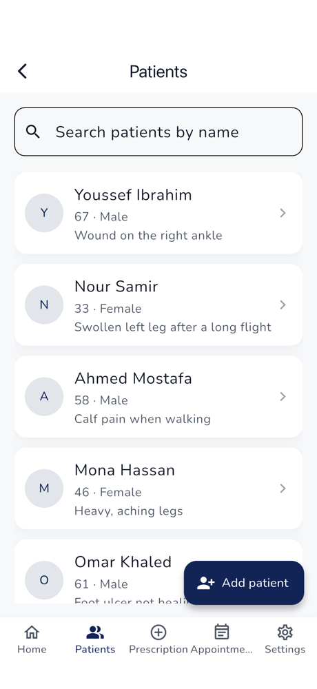 | 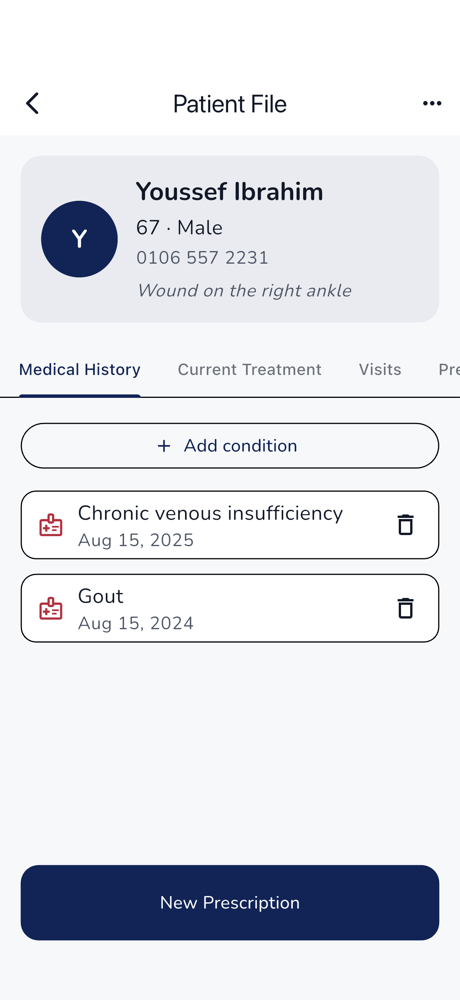 |
| **Current treatment** | **New prescription** | **Prescription preview** |
| 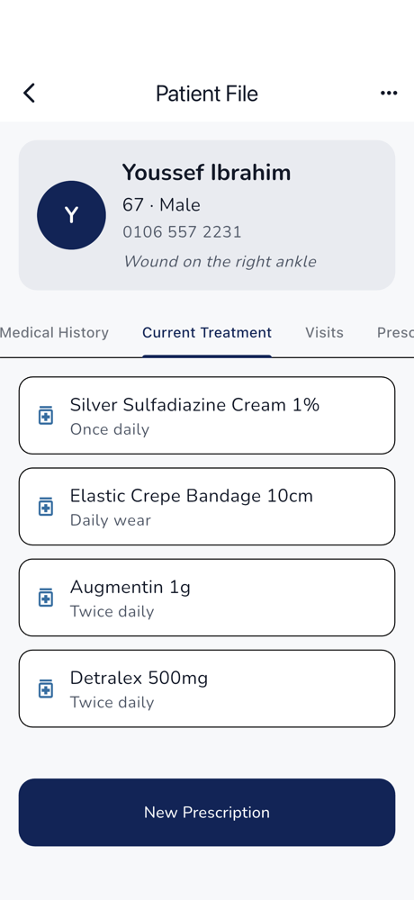 | 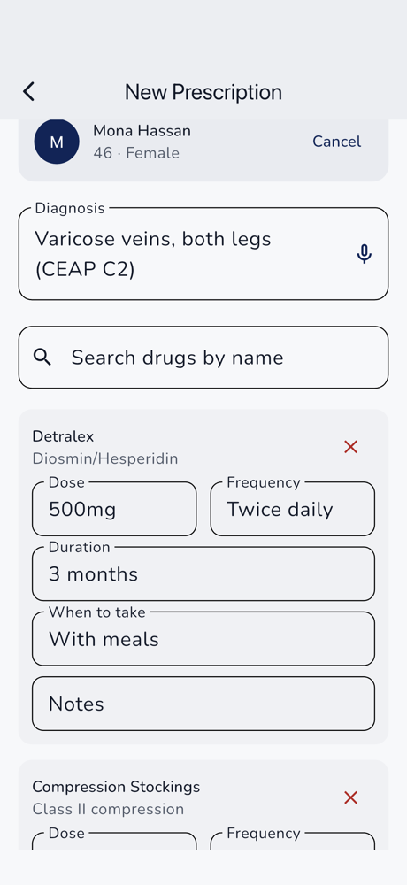 |  |
| **Appointments** | **Drug database** | **Clinic stats** |
| 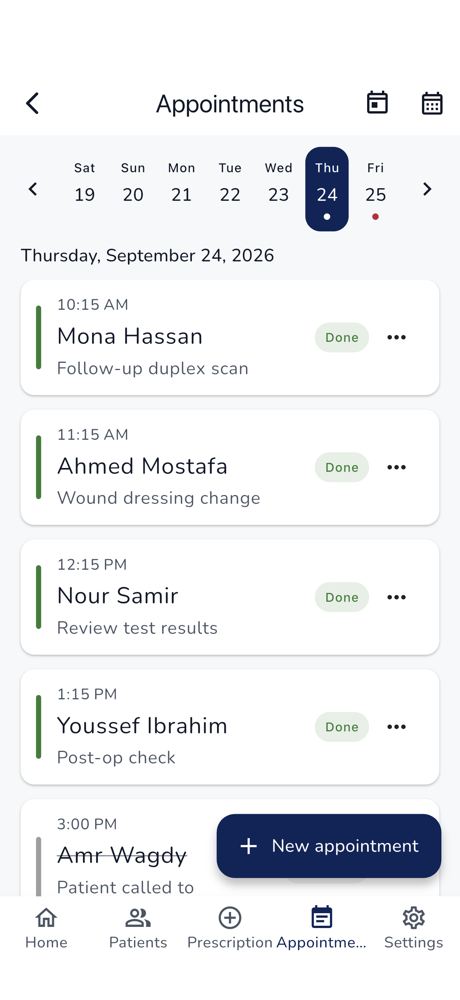 | 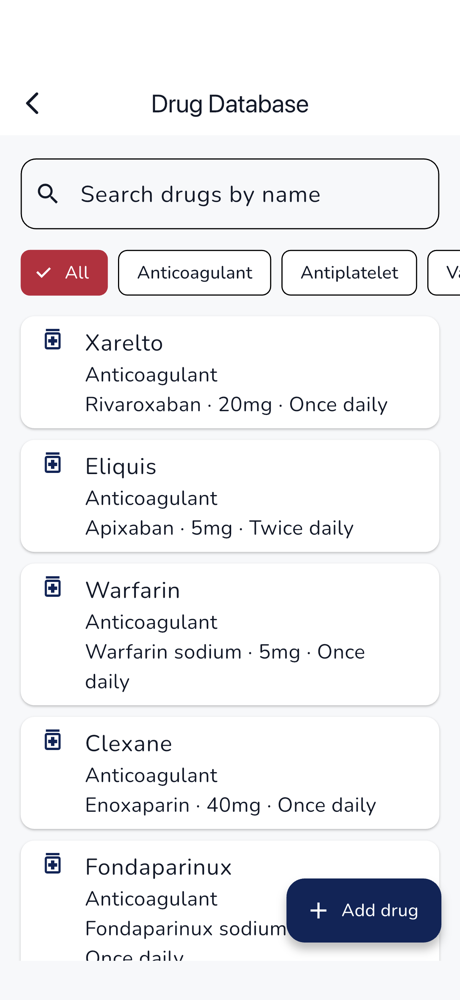 | 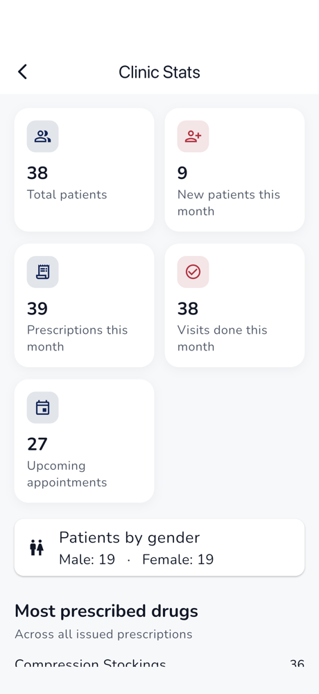 |
| **Settings** | **Dark mode** | **Arabic** |
| 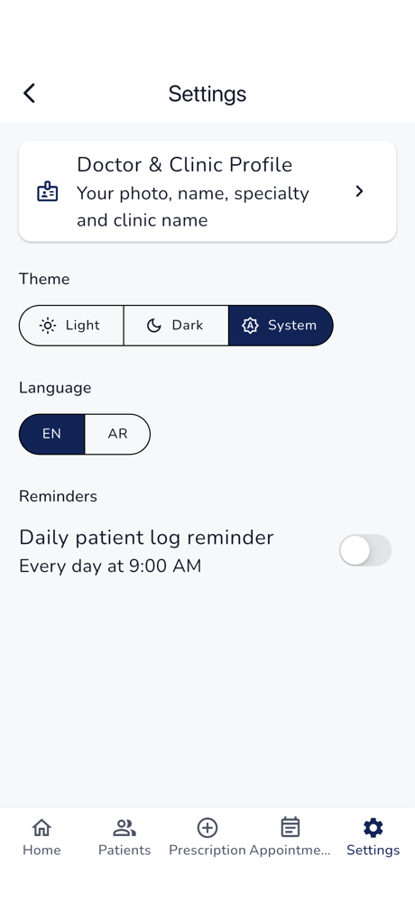 | 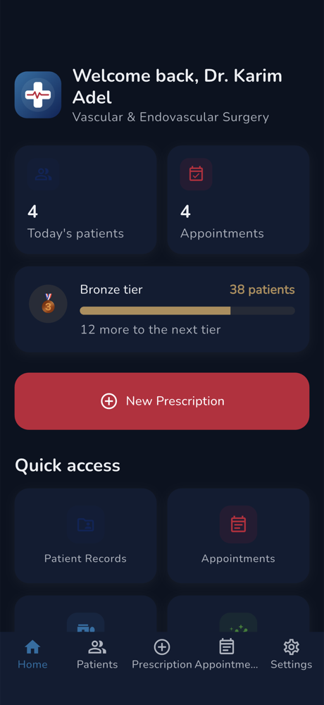 | 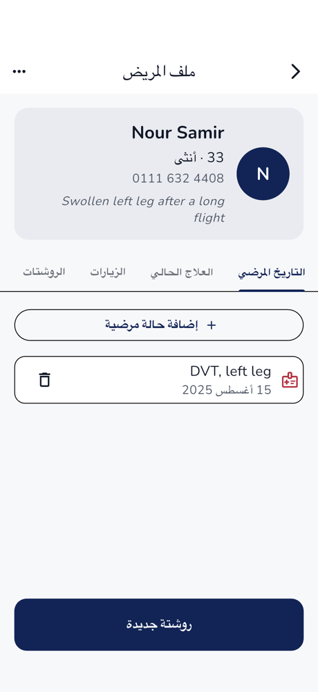 |

More screens are in [docs/screenshots/](docs/screenshots/).

## Run it

```bash
flutter pub get
flutter run
```

All data is stored on the device, so no setup or internet is needed. To
prepare the optional Supabase backend, see
[docs/SUPABASE_SETUP.md](docs/SUPABASE_SETUP.md).

## Demo data

To try the app with a full, realistic clinic instead of an empty one, pass
the demo flag:

```bash
flutter run --dart-define=DEMO_DATA=true    # seed once, keep your edits
flutter run --dart-define=DEMO_DATA=reset   # wipe and re-seed every launch
```

This fills in a fictional vascular surgery clinic run by "Dr. Karim Adel". It
has 38 patients with medical history, 65 issued prescriptions plus two
drafts, and a busy week of appointments. All dates are relative to the day
you launch, so today always has patients, and the stats screen always shows
a full month. Every name and phone number is made up.

A normal build never runs the seeder. The data lives in
[lib/core/demo/demo_data_seeder.dart](lib/core/demo/demo_data_seeder.dart).

## Record the demo video and screenshots

The video and every screenshot above come from one scripted tour that drives
the real app on an iOS simulator:

```bash
open -a Simulator          # boot any iPhone simulator
scripts/record_demo.sh     # or: scripts/record_demo.sh <simulator-udid>
```

The script sets a clean status bar, runs
[integration_test/demo_tour_test.dart](integration_test/demo_tour_test.dart),
records only the tour itself, and compresses the video to about 10 MB. It
writes the video to `docs/demo/` and the screenshots to `docs/screenshots/`.
It needs Xcode, but no other tools.

## Test

```bash
flutter analyze
flutter test
```

The tests cover persistence, every repository, the main cubits, the demo
data, and two full app walk-throughs, one in English and one in Arabic.

## Code layout

Feature-first Clean Architecture under `lib/features/<feature>/`:

- `data/` holds models and on-device datasources.
- `repository/` maps exceptions to typed failures with `dartz` `Either`.
- `presentation/` holds Cubits, screens and widgets.

Shared pieces live in `lib/core/`. That includes dependency injection
(`get_it`), routing, theming, the JSON store over SharedPreferences, and the
change signal that refreshes open screens after any edit.
